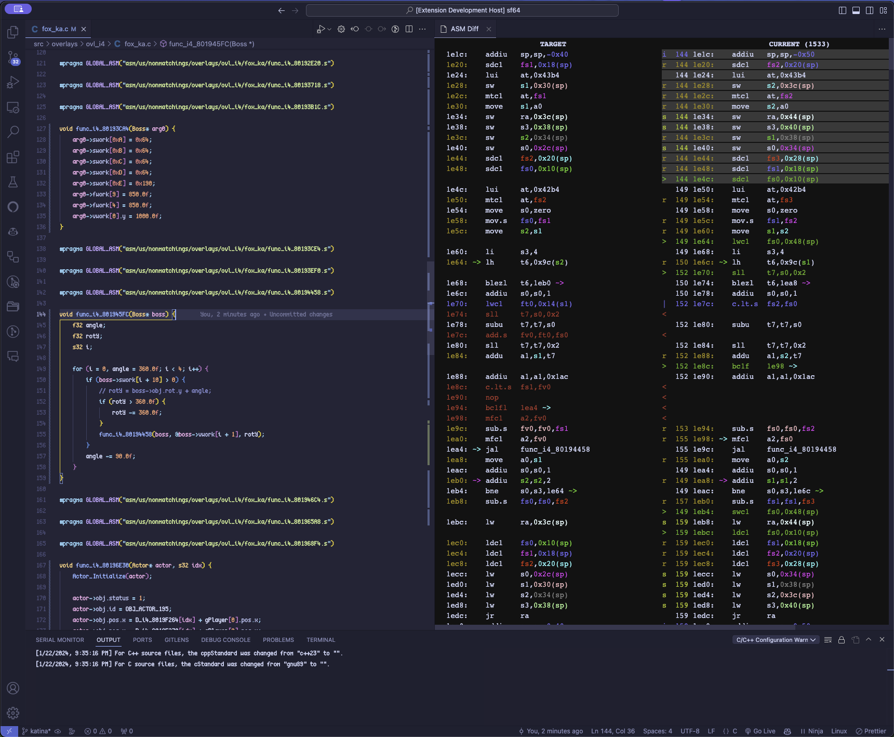

# VSCode ASM Diff

Nice differ for assembly code. Currently supports MIPS, PPC, AArch64, ARM32, SH2, SH4, and m68k; powered by the amazing [asm-differ](https://github.com/simonlindholm/asm-differ) from simonlindholm.

## Dependencies

- Python >= 3.6
- `python3 -m pip install --user colorama watchdog levenshtein cxxfilt` (also `dataclasses` if on 3.6)

## Usage

* Inside a file with a function you want to diff, highlight the function name and launch the command `> ASM Diff: Diff function`
* Its recommended to do it on the same workspace as the source file to avoid issues with relative paths

## TO-DO

- [ ] Add support to customize the arguments passed to the asm-differ
- [ ] Add decomp.me support to create scratch files
- [ ] Fix the responsiveness of the diff view
- [ ] MinGW support

## Contributing

Feel free to open an issue or a PR if you find any bug or have any suggestion.

## Credits

- [asm-differ](https://github.com/simonlindholm/asm-differ)
- [Lywx](https://github.com/KiritoDv) Made with ❤️
